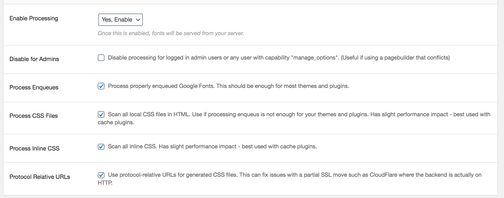
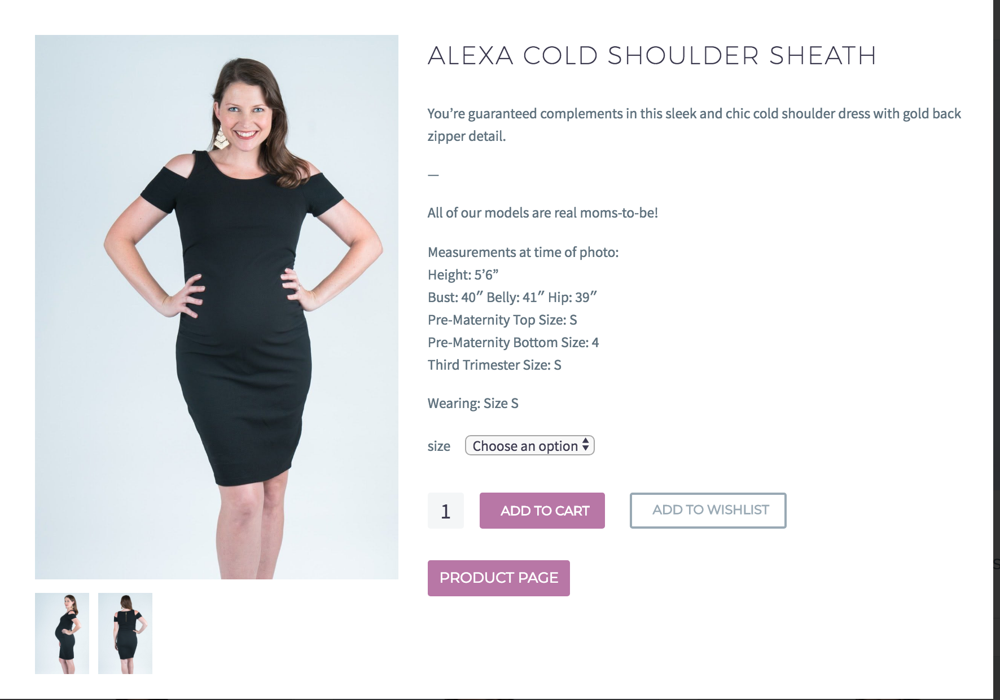

# Bella Nove


## Work from November to December 2019
- [Code Changes](#code-changes)
	- [Add Billing Address](#add-billing-address)
	- [Purchase Page Aesthetics](#purchase-page-aesthetics)
	- [Change Email Sender](#change-email-sender)
	- [Hide Prices](#hide-prices)
	- [Membership Role Relationship](#membership-role-relationship)
	- [Profile Page Buttons](#profile-page-buttons)
- [Design and CSS Changes](#design-and-css-changes)
	- [Quickview](#quickview)
- [WP Configuration](#wp-configuration)
	- [Membership Upgrade Options](#membership-upgrade-path)
	- [Signup Confirmation Email](#signup-confirmation-email)
- [Improving Page Load Speed](#improving-page-speed)


## Work from July 16 to November 7 2018.
- [Code](#code)
   - [The Gem Child Theme](#the-gem-child-theme)
   - [Google Fonts](#google-fonts)
   - [Refresh CSS](#refresh-css)
   - [ReferralCandy Code](#referralcandy-code)
   - [Add Product Images to Confirmation Email](#add-product-images-to-confirmation-email)
   - [Add to Wishlist within Cart Page](#add-to-wishlist-within-cart-page)
   - [User Roles Issue](#user-roles-issue)
   - [3 Items per Row on All Page](#3-items-per-row-on-all-page)
   - [Product Thumbnail Size](#product-thumbnail-size)
   - [Change Memberships Page](#change-memberships-page)
   - [Payment Page](#payment-page)
- [Design and UX](#design-and-ux)
   - [Top Menu Consolidation and UX Improvements](#top-menu-consolidation-&-ux-improvements)
   - [Consolidating Dashboard and Edit Account Pages](#consolidating-dashboard-and-edit-account-pages)
   - [Add a Footer Menu](#add-a-footer-menu)
   - [Format Contact and Gift Form Pages](#format-contact-and-gift-form-pages)
   - [Add Size Guide](#add-size-guide)
   - [Remove Buttons on Product Cards](#remove-buttons-on-product-cards)
   - [Mini-Cart Scroll](#mini-cart-scroll)
   - [Gifting UX](#gifting-ux)
   - [Registration Page](#registration-page)
   - [Login Page Button Spacing](#login-page-button-spacing)
   - [Hide Unnecessary Text](#hide-unnecessary-text)
   - [Reduce Product Page Image Size](#reduce-product-page-image-size)
   - [Uniform Buttons](#uniform-buttons)
   - [Too Many Items In Cart](#too-many-items-in-cart)
   - [Remove Additional Info Tab for Reviews](#remove-additional-info-tab-for-reviews)
   - [Uniform Fonts, Alignment, and Other Added CSS](#uniform-fonts-,-alignment,-and-other-added-css)
- [Mobile](#mobile)
   - [Dashboard](#dashboard)
   - [Register Page](#register-page)
   - [Cart Content](#cart-content)
- [Plugins](#plugins)
   - [Product Reviews](#product-reviews)
   - [Sitemap and SEO](#sitemap-and-seo)
   - [Quickview](#quickview)
   - [Add Login Button to Menu](add-login-button-to-menu)
- [Other](#other)
   - [Staging Site](#staging-site)
   - [Databases](#databases)
   - [Cloudflare](#cloudflare)
   - [Site Optimization](#site-optimization)
   - [Facebook Shop](#facebook-shop)

## Code Changes
### Add Billing Address
- **Problem**: We would like to add a billing address form to the membership sign up page. It needs to persist on the "My Account" page under "Addresses" and the checkout page.
- **Solution**: Add this code to `functions.php`:
```
if( !is_admin() )
{
    // Function to check starting char of a string
    function startsWith($haystack, $needle)
    { 
        return $needle === '' || strpos($haystack, $needle) === 0;
    }

    // Custom function to display the Billing Address form to registration page
    add_action('register_form','add_billing_form');
    function add_billing_form()
    {
        global $woocommerce;
        $checkout = $woocommerce->checkout();

        ?>
            <h3><?php _e( 'Billing Address', 'woocommerce' ); ?></h3>
        <?php

        foreach ($checkout->checkout_fields['billing'] as $key => $field) :
            if($key!='billing_email')
                woocommerce_form_field( $key, $field, $checkout->get_value( $key ) );
        endforeach;
    }
    

    // Custom function to save Usermeta or Billing Address of registered user
    add_action('user_register','save_address');
    function save_address($user_id)
    {
        global $woocommerce;
        $address = $_POST;

        foreach ($address as $key => $field) :
            if(startsWith($key,'billing_'))
            {
                // Condition to add firstname and last name to user meta table
                if($key == 'billing_first_name' || $key == 'billing_last_name')
                {
                    $new_key = explode('billing_',$key);
                    update_user_meta( $user_id, $new_key[1], $_POST[$key] );
                }
                update_user_meta( $user_id, $key, $_POST[$key] );
            }
        endforeach;
    }
    

    // Registration page billing address form Validation
    add_action('register_post', 'custom_validation');
    function custom_validation()
    {
        global $woocommerce;
        $address = $_POST;

        foreach ($address as $key => $field) :

            // Validation: Required fields
            if(startsWith($key,'billing_'))
            {

                if($key == 'billing_country' && $field == '')
                {
                    $woocommerce->add_error( '' . __( 'ERROR', 'woocommerce' ) . ': ' . __( 'Please select a country.', 'woocommerce' ) );
                }

                if($key == 'billing_first_name' && $field == '')
                {
                    $woocommerce->add_error( '' . __( 'ERROR', 'woocommerce' ) . ': ' . __( 'Please enter first name.', 'woocommerce' ) );
                }

                if($key == 'billing_last_name' && $field == '')
                {
                    $woocommerce->add_error( '' . __( 'ERROR', 'woocommerce' ) . ': ' . __( 'Please enter last name.', 'woocommerce' ) );
                }

                if($key == 'billing_address_1' && $field == '')
                {
                    $woocommerce->add_error( '' . __( 'ERROR', 'woocommerce' ) . ': ' . __( 'Please enter address.', 'woocommerce' ) );
                }

                if($key == 'billing_city' && $field == '')
                {
                    $woocommerce->add_error( '' . __( 'ERROR', 'woocommerce' ) . ': ' . __( 'Please enter city.', 'woocommerce' ) );
                }

                if($key == 'billing_state' && $field == '')
                {
                    $woocommerce->add_error( '' . __( 'ERROR', 'woocommerce' ) . ': ' . __( 'Please enter state.', 'woocommerce' ) );
                }

                if($key == 'billing_postcode' && $field == '')
                {
                    $woocommerce->add_error( '' . __( 'ERROR', 'woocommerce' ) . ': ' . __( 'Please enter a postcode.', 'woocommerce' ) );
                }

                if($key == 'billing_email' && $field == '')
                {
                    $woocommerce->add_error( '' . __( 'ERROR', 'woocommerce' ) . ': ' . __( 'Please enter billing email address.', 'woocommerce' ) );
                }

                if($key == 'billing_phone' && $field == '')
                {
                    $woocommerce->add_error( '' . __( 'ERROR', 'woocommerce' ) . ': ' . __( 'Please enter phone number.', 'woocommerce' ) );
                }
            }

        endforeach;
    }
   
}

References: [WP Developer Docs](https://developer.wordpress.org/reference/hooks/user_register/), [StackOverflow 1](https://stackoverflow.com/questions/37510687/hide-billing-address-from-checkout-page-but-keep-the-information/37511524#37511524), [StackOverflow2](https://stackoverflow.com/questions/39964783/add-billing-address-to-woocommerce-registration-page)

```
Add some CSS to `custom.css` to keep consistency with the rest of the form:
```
/* registration pg - billing address formatting */
div.ms-extra-fields > p  {
	display: flex;
	flex-direction: row;
	justify-content: space-between;
}

div.ms-extra-fields > p#billing_address_2_field {
	display: flex;
	flex-direction: row;
	justify-content: flex-end;
}

div.ms-extra-fields > h3 {
	color: #000;
    font-family: 'Montserrat', Arial, sans-serif;
    font-size: 2em;
}

/* registration pg */
/* removes the 3 dots under asterisk for form required fields */
form abbr[title] {
    border-bottom: none !important;
    text-decoration: none !important;
}
/* hide * from required fields */
abbr.required {
	display: none;
}

/* form alignment/color */
.ms-form-element {
	margin-left:0;
	margin-right:0;
}
.ms-form-element .wpmui-field-label {
	color: #5f727f;
}
.ms-form-element .wpmui-field-input {
	margin: 0;
}
/* add max width for country select */
select#billing_country {
	max-width: 170px;
}

/* register page button */
form#ms-shortcode-register-user-form button#register {
	background-color: rgb(185, 118, 167);
	border-radius: 3px;
	color: #fff;
	font-family: 'Montserrat', Arial, sans-serif;
	padding: 8px 13px 8px 13px;
	text-transform: uppercase;
	margin-right:0;
}

div.ms-membership-form-wrapper a.wpmui-link {
	background-color: transparent;
	color: #00bcd4;
	float: right;
	font-size: 16px;
	font-weight: 400;
	line-height: 25px;
	margin: 0;
	text-transform: none;
	padding-right:0;
}

/* MOBILE - register page */
@media only screen and (max-width: 425px) {
	.ms-form-element .wpmui-field-label {
		color: #5f727f; /* 12/2019 update */
	}
}
```

### Purchase Page Aesthetics
- **Problem**: We would like the payment page to look nicer.
- **Solution**: Almost complete re-write of `membership_frontend_payment.php` in `plugins/membership-pro/app/view/templates`:

Original Code

```
<?php/**
* this file contains updates to the payment page 
**/?>
<div class="<?php echo get_ms_pm_membership_wrapper_class(); ?>">
    <legend><?php _e( 'Join Membership', 'membership2' ) ?></legend>
    <p class="ms-alert-box <?php echo get_ms_pm_alert_box_class(); ?>">
        <?php echo get_ms_pm_message(); ?>
    </p>
    <table class="ms-purchase-table">
        <tr>
            <td class="ms-title-column"></td>
            <td class="ms-details-column membership-column">
                You have selected the <br /><span class="membership-type"><?php echo get_ms_pm_membership_name();?></span><br /> membership!
            </td>
         </tr>
		<?php if ( is_ms_pm_membership_description() ) : ?>
        <tr>
            <td class="ms-title-column"></td>
            <td class="ms-desc-column">
                <span class="ms-membership-description"><?php echo get_ms_pm_membership_description();?></span>
            </td>
         </tr>
        <?php endif; ?>
		<?php if ( ! is_ms_pm_membership_free() ) : ?>
        <?php if ( is_ms_pm_invoice_discount() || is_ms_pm_invoice_pro_rate() || is_ms_pm_invoice_tax_rate() ) : ?>
        <tr>
            <td class="ms-title-column"></td>
            <td class="ms-details-column">
            <?php
                if ( get_ms_pm_membership_price() > 0 ) {
                    echo "Price per month: " . get_ms_pm_membership_formatted_price();
                } else {
                    _e( 'Free', 'membership2' );
                }?>
            </td>
        </tr>
        <?php endif; ?>
		<?php if ( is_ms_pm_invoice_discount() ) : ?>
        <tr>
            <td class="ms-title-column"></td>
            <td class="ms-price-column">
                <?php echo "Coupon Discount: " . get_ms_pm_invoice_formatted_discount(); ?>
            </td>
        </tr>
        <?php endif; ?>
		<?php if ( is_ms_pm_invoice_pro_rate() ) : ?>
        <tr>
            <td class="ms-title-column"></td>
            <td class="ms-price-column">
                <?php echo 'Pro-Rate Discount: ' . get_ms_pm_invoice_formatted_pro_rate(); ?>
            </td>
        </tr>
        <?php endif; ?>
		<?php if ( is_ms_pm_show_tax() ) : ?>
        <tr>
            <td class="ms-title-column">
                <?php echo get_ms_pm_invoice_tax_name(); ?>
            </td>
            <td class="ms-price-column">
                <?php echo get_ms_pm_invoice_tax_name() . ': ' . get_ms_pm_invoice_formatted_tax(); ?>
            </td>
        </tr>
        <?php endif; ?>
		<tr>
            <td class="ms-title-column"></td>
            <td class="ms-price-column ms-total">
            <?php
                if ( get_ms_pm_invoice_total() > 0 ) {
                    if ( is_ms_admin_user() ) {
                        echo 'Total: ' . get_ms_pm_invoice_formatted_total_for_admin();
                    	} else {
                            echo 'Total: ' .get_ms_pm_invoice_formatted_total();
                        }
                    } else {
                        _e( 'Free', 'membership2' );
                }?>
            </td>
        </tr>
		<?php if ( is_ms_pm_trial() ) : ?>
        <tr>
            <td class="ms-title-column"></td>
            <td class="ms-desc-column"><?php echo 'Payment due ' . get_ms_pm_invoice_formatted_due_date();?></td>
        </tr>
        <tr>
            <td class="ms-title-column"></td>
            <td class="ms-desc-column">
            <?php
                if ( get_ms_pm_invoice_trial_price() > 0 ) {
                    echo 'Trial price: ' . get_ms_pm_invoice_formatted_trial_price();
                } else {
                    _e( 'Free', 'membership2' );
                }?>
            </td>
        </tr>
        <?php endif; ?>
		<?php
			do_action(
			'ms_view_frontend_payment_after_total_row',
            get_ms_payment_subscription(),
            get_ms_payment_invoice(),
            get_ms_payment_obj());?>
		<tr>
            <td class="ms-desc-column" colspan="2">
                <span class="ms-membership-description"><?php echo get_ms_pm_invoice_payment_description();?></span>
            </td>
        </tr>
        <?php endif; ?>
		<?php if ( is_ms_pm_cancel_warning() ) : ?>
        <tr>
            <td class="ms-desc-warning" colspan="2">
                <span class="ms-cancel-other-memberships"><?php echo get_ms_pm_cancel_warning();?></span>
            </td>
        </tr>
        <?php endif;
		if ( is_ms_admin_user() ) : ?>
        <tr>
            <td class="ms-desc-adminnote" colspan="2">
                <em><?php _e( 'As admin user you already have access to this membership', 'membership2' );?></em>
            </td>
        </tr>
        <?php else :
            do_action(
                'ms_view_frontend_payment_purchase_button',
                get_ms_payment_subscription(),
                get_ms_payment_invoice(),
                get_ms_payment_obj());
        endif;?>
    </table>
</div>
<?php
do_action( 'ms_view_frontend_payment_after', get_ms_payment_obj_data(), get_ms_payment_obj() );
do_action( 'ms_show_prices' );

if ( is_ms_pm_show_tax() ) {
    do_action( 'ms_tax_editor', get_ms_payment_invoice() );
}
?>
<div style="clear:both;"></div>
```

New

```
<?php/**
* this file contains updates to the payment page 
**/?>
<div class="<?php echo get_ms_pm_membership_wrapper_class(); ?>">
  <legend style="text-align: center"><?php _e( 'Join Membership', 'membership2' ) ?></legend>
  <div class="membership-payment-page">
    <div style="border: 2px solid #3c3950;padding: 30px 90px;">
      <div style="display: flex;flex-direction: column;justify-content: center;align-items: center; text-align: center;">
        <p style="font-style: italic;margin-bottom: 20px;color: #3c3950;font-family: 'Montserrat UltraLight';
          font-size: 18px;">You have selected the </p>
        <div style="border: 1px #d4aeca solid; margin-bottom: 20px;width: 80%;"></div>
        <div style="width: 160px;height: 160px;background-color: #d4aeca;border-radius: 100px;display: flex;align-items: center;justify-content: center;margin-bottom: 20px;">
          <p style="margin:0;color: white; font-family: 'Montserrat';font-size: 25px;"><?php echo get_ms_pm_membership_name();?></p>
        </div>
        <div style="border: 1px #d4aeca solid; margin-bottom: 20px;width: 80%;"></div>
        <p style="font-style: italic; margin:0;color: #3c3950;font-family: 'Montserrat UltraLight';font-size: 18px;">membership!</p>
      </div>
    </div>
    <div style="display: flex;flex-direction: column;justify-content: center;">
      <div style="display: flex;flex-direction: column;align-items: center;">
        <div style="background-color: #d4aeca;color: white;padding: 0 10px 0 10px;font-family: 'Montserrat UltraLight';font-size: 25px;margin-bottom: 8px;text-align: start;">
          Please complete your
        </div>
        <div style="background-color: #d4aeca;color: white;padding: 0 10px 0 10px;font-family: 'Montserrat UltraLight';font-size: 25px;margin-bottom: 40px;">
          purchase below:
        </div>
        <?php if (is_ms_pm_membership_description()) : ?>
          <div>
            <?php echo get_ms_pm_membership_description();?>
          </div>
         <?php endif; ?>
      </div>
    <table class="ms-purchase-table" style="background-color: unset; width: 100%; margin:0;">
      <?php if ( ! is_ms_pm_membership_free() ) : ?>
          <?php if ( is_ms_pm_invoice_discount() || is_ms_pm_invoice_pro_rate() || is_ms_pm_invoice_tax_rate() ) : ?>
              <tr>
                <td class="ms-details-column">
                  <?php if ( get_ms_pm_membership_price() > 0 ) {
                    echo "Price per month: " . get_ms_pm_membership_formatted_price();
                    } else {
                      _e( 'Free', 'membership2' );
                    }?></td>
              </tr>
      <?php endif; ?>
      <?php if ( is_ms_pm_invoice_discount() ) : ?>
        <tr>
          <td class="ms-price-column">
            <?php echo "Coupon Discount: " . get_ms_pm_invoice_formatted_discount(); ?>
          </td>
        </tr>
      <?php endif; ?>
      <?php if ( is_ms_pm_invoice_pro_rate() ) : ?>
        <tr>
            <td class="ms-price-column">
              <?php echo 'Pro-Rate Discount: ' . get_ms_pm_invoice_formatted_pro_rate(); ?>
            </td>
        </tr>
      <?php endif; ?>
      <?php if ( is_ms_pm_show_tax() ) : ?>
        <tr>
          <td class="ms-title-column">
            <?php echo get_ms_pm_invoice_tax_name(); ?>
          </td>
          <td class="ms-price-column">
            <?php echo get_ms_pm_invoice_tax_name() . ': ' . get_ms_pm_invoice_formatted_tax(); ?>
          </td>
        </tr>
      <?php endif; ?>
      <?php if ( is_ms_pm_trial() ) : ?>
        <tr>
          <td class="ms-desc-column"><?php
            echo 'Payment due ' . get_ms_pm_invoice_formatted_due_date();
          ?></td>
        </tr>
        <tr>
          <td class="ms-desc-column">
            <?php
              if ( get_ms_pm_invoice_trial_price() > 0 ) {
                echo 'Trial price: ' . get_ms_pm_invoice_formatted_trial_price();
              } else {
                _e( 'Free', 'membership2' );
              }?>
          </td>
        </tr>
      <?php endif; ?>
      <?php do_action('ms_view_frontend_payment_after_total_row', get_ms_payment_subscription(), get_ms_payment_invoice(), get_ms_payment_obj());?>
        <tr>
          <td class="ms-desc-column" colspan="2">
             <span class="ms-membership-description"><?php echo get_ms_pm_invoice_payment_description();?></span>
          </td>
        </tr>
      <?php endif; ?>
      <?php if ( is_ms_pm_cancel_warning() ) : ?>
        <tr>
          <td class="ms-desc-warning" colspan="2">
            <span class="ms-cancel-other-memberships"><?php echo get_ms_pm_cancel_warning();?></span>
          </td>
        </tr>
      <?php endif;
      if ( is_ms_admin_user() ) : ?>
        <tr>
          <td class="ms-desc-adminnote" colspan="2">
            <em><?php _e( 'As admin user you already have access to this membership', 'membership2' );?></em>
          </td>
        </tr>
      <?php else : do_action('ms_view_frontend_payment_purchase_button', get_ms_payment_subscription(), get_ms_payment_invoice(), get_ms_payment_obj());
      endif;?>
    </table>
    </div>
    </div>
  </div>
<?php do_action( 'ms_view_frontend_payment_after', get_ms_payment_obj_data(), get_ms_payment_obj() );
do_action( 'ms_show_prices' );

if ( is_ms_pm_show_tax() ) {
  do_action( 'ms_tax_editor', get_ms_payment_invoice() );
}
?>
<div style="clear:both;"></div>
```

Also added some CSS to `custom.css`:

```
/* membership payment page - update 12/2019*/
.membership-payment-page {
	display: flex;
	justify-content: space-evenly;
}

/* membership page mobile */
@media screen and (max-width: 980px) {
	.membership-payment-page {
		display: flex;
		justify-content: space-evenly;
		flex-direction: column;

	}
	.membership-payment-page > div {
		margin-bottom: 40px;
	}
}

```

New Design


### Change Email Sender
- **Problem**: We would like emails sent by WordPress to come from "BellaNove" instead of "Wordpress"
- **Solution**: Add this code to `functions.php`:

```

// Function to change email address
function wpb_sender_email( $original_email_address ) {
    return 'hello@bellanove.com';
}
 
// Function to change sender name
function wpb_sender_name( $original_email_from ) {
    return 'BellaNove';
}
 
// Hooking up our functions to WordPress filters 
add_filter( 'wp_mail_from', 'wpb_sender_email' );
add_filter( 'wp_mail_from_name', 'wpb_sender_name' );
```

[Reference](https://www.wpbeginner.com/plugins/how-to-change-sender-name-in-outgoing-wordpress-email/)


### Hide Prices
- **Problem**: We do not want prices to show up anywhere on the site; prices appear on wishlist page, mini cart dropdown, cart page, checkout page, order confirmation page, order confirmation email, and in My Account page under "Orders" > order #.
- **Solution**: 

Additions to `custom.css`:

```
/* mini cart dropdown */
#primary-menu.no-responsive > li.menu-item-cart > .minicart ul li .quantity,
#primary-menu.no-responsive > li.menu-item-cart > .minicart .total {
	display: none;
}

/* cart page */
.woocommerce-cart-form .shop_table .product-price,
.woocommerce-cart-form .shop_table .product-subtotal, 
div.cart_totals.calculated_shipping {
	display: none;
}

.cart-collaterals {
	display: none;
}

/* checkout page */
.woocommerce-checkout-one-page #order_review table thead th.product-total,
.woocommerce-checkout-one-page #order_review table tbody tr td.product-total,
.woocommerce-checkout-one-page #order_review table tr.cart-subtotal,
.woocommerce-checkout-one-page #order_review table tr.order-total {
	display: none;
}

.shop_table .product-name .product-title  {
	display: flex;
	justify-content: space-between;
}

/* wishlist */
.woocommerce .wishlist_table .product-price {
	display: none;
}

/* order confirmation page */
.woocommerce .shop_table thead tr th.woocommerce-table__product-table.product-total {
	display: none;

}
.woocommerce ul.order_details li.woocommerce-order-overview__total.total {
	display: none;
}
.woocommerce .shop_table tbody tr td.woocommerce-table__product-total.product-total {
	display: none;
}
/* cart totals table */
div.col-sm-12.col-md-6.order-details-column,
div.col-sm-12.order-details-column {
	display: none;
}
div.col-xs-12.col-md-6.order-details-column {
	width: 100%;
}
.woocommerce .shop_table thead tr th.product-quantity,
.woocommerce .shop_table tbody tr td.product-quantity {
	border-right:#dfe5e8 1px solid;
}
```

For the email change, I needed to add some template overrides for `email-order-details.php` and `email-order-item.php` in `themes/the-gem-child-new/woocommerce/emails/`, the only edits were the removal of these lines of code:

From `email-order-details.php`:

```
$item_totals = $order->get_order_item_totals();

if ( $item_totals ) {
	$i = 0;
	foreach ( $item_totals as $total ) {
	$i++;
	?>
	<tr>
		<th class="td" scope="row" colspan="2" style="text-align:<?php echo esc_attr( $text_align ); ?>; <?php echo ( 1 === $i ) ? 'border-top-width: 4px;' : ''; ?>"><?php echo wp_kses_post( $total['label'] ); ?></th>
		<td class="td" style="text-align:<?php echo esc_attr( $text_align ); ?>; <?php echo ( 1 === $i ) ? 'border-top-width: 4px;' : ''; ?>"><?php echo wp_kses_post( $total['value'] ); ?></td>
	</tr>
	<?php
	}
}

```

and

```
<th class="td" scope="col" style="text-align:<?php echo esc_attr( $text_align ); ?>;"><?php esc_html_e( 'Price', 'woocommerce' ); ?></th>
```

From `email-order-item.php`:

```
<td class="td" style="text-align:<?php echo esc_attr( $text_align ); ?>; vertical-align:middle; font-family: 'Helvetica Neue', Helvetica, Roboto, Arial, sans-serif;">
	<?php echo wp_kses_post( $order->get_formatted_line_subtotal( $item ) ); ?>
</td>
```

[Reference](https://wordpress.org/support/topic/remove-price-woocommerce-new-order-template/)

### Membership Role Relationship
- **Problem**: When users upgraded/changed their membership to one of `Starter - 5`, `Surprise Me - 3`, or `Surprise Me - 5`, their role was not updated to the one corresponding to their membership (they retained the role of their previous membership).
- **Solution**: These 3 new roles (and any subsequent new roles) need to be added to the `ms_controller_member_assign_memberships_done_cb` function in `functions.php`. It requires the new membership ID and the new role name. See the updated function below:

```
function ms_controller_member_assign_memberships_done_cb( $membership_id, $user_id, $gateway_id, $move_from_id ) {
	$user = new WP_User( $user_id );
	switch( $membership_id ){
		case 3702:
			$user->set_role( 'starter_closet' );
			break;
		
		case 3722:
			$user->set_role( 'enhanced_closet' );
			break;
		
		case 3723:
			$user->set_role( 'ultimate_closet' );
			break;
        case 30959:
            $user->set_role( 'surprise3' );
            break;
        case 30961:
            $user->set_role( 'surprise-5' );
            break;
        case 31032:
            $user->set_role( 'starter5' );
            break;
	}
}
```

### Profile Page Buttons
- **Problem**: We want buttons for "Shop" and "Cart" to appear at the bottom of this page.
- **Solution**: This required editing the plugin file within buddy press (`plugins/buddypress/bp-templates/bp-legacy/buddypress/members/single/profile.php) plus CSS additions.

Added these lines to `line 66` of `profile.php`:

```
<div class="profile-button-group">
	<a class="profile-button" href="https://www.bellanove.com/browse-closet/" class="button">Shop</a>
	<a class="profile-button" href="https://www.bellanove.com/cart/" class="button">Cart</a>
</div>
```

Added this to `custom.css`:

```
#buddypress .standard-form div.submit {
	padding: 0;
}

#buddypress .standard-form div.submit input {
	margin-bottom: 0;
}

div.profile-button-group {
	display: flex;
    justify-content: space-evenly;
    margin-top: 30px;
}

a.profile-button {
	background-color: rgb(185, 118, 167);
    border-radius: 3px;
    color: #fff;
    font-family: 'Montserrat', Arial, sans-serif;
    padding: 8px 13px 8px 13px;
    text-transform: uppercase;
}
```

## Design & CSS Changes
### Quickview
- **Problem**: There are some issues with quickview layout
- **Solution**: Additions to `custom.css`:

```
div.xoo-qv-container {
	height: 90%;
}

div.woocommerce-product-details__short-description {
	font-size: 1.25rem;
}

a.reset_variations {
	display: inline;
    margin-left: 1rem;
}

div.woocommerce-product-details__short-description > p {
	margin-bottom: 5px;
}

.woocommerce-variation.single_variation .woocommerce-variation-availability {
	padding: 10px;
}

div.xoo-qv-summary .single_add_to_cart_button {
	margin-top: 0px;
	margin-bottom: 10px;
}

div.variations_button {
	margin-top: 10px;
}
```

## WP Configuration
### Membership Upgrade Path
- **Problem**: Not all membership upgrades were showing up as available to upgrade to (specifically Surprise Me-5 pieces)
- **Solution**: This was a misconfiguration in WP backend. The “Surprise Me - 5 pieces” membership was not set to public. To fix it got to membership2 > memberships > edit for “Surprise Me - 5 pieces” > details > “This membership is public” set to yes. Now able to see all the correct memberships that are available.

### Signup Confirmation Email
- **Problem**: We want customers to receive a confirmation of their membership after they sign up
- **Solution**: We can configure this in WP backend. Go to membership2 > settings > automated email responses, then activated email for “subscription - complete with payment".

## Improving Page Load Speed
- I used the [GTMetrix](https://gtmetrix.com) site to test page speed and used these sites [Why is WordPress so Slow](https://onlinemediamasters.com/why-is-wordpress-so-slow/) and [GTMetrix - WordPress Optimization Guide](https://gtmetrix.com/wordpress-optimization-guide.html) as helpful guides to interpret the results of the GTMetrix report and make the corresponding fixes.
- Before updating the main site, I created a subdomain (test.bellanove.com) created from a backup of the main site to test out the updates/optimizations to ensure nothing breaks the site.

### Delete all inactive and unused plugins
- This reduces page size and requests

### Delete all inactive and unused plugins
- This reduces page size and requests

### Remove unused JavaScript snippets
- This actually improved PageSpeed score by a whole 1%
- We are no longer using Friendbuy, so I removed this code snippet from `header.php`:

```
<script>
    window['friendbuy'] = window['friendbuy'] || [];
    window['friendbuy'].push(['site', 'site-a667e411-www.bellanove.com']);
    window['friendbuy'].push(['track', 'customer',
        {
            id: '', //INPUT ORDER ID
			amount: '', //INPUT ORDER AMOUNT
			coupon_code: '', //OPTIONAL, coupon code if used for order
             new_customer: '', //OPTIONAL, true if this is the customer's first purchase
 			email: '' //INPUT EMAIL
        }
    ]);
    (function (f, r, n, d, b, y) {
        b = f.createElement(r), y = f.getElementsByTagName(r)[0];b.async = 1;b.src = n;y.parentNode.insertBefore(b, y);
    })(document, 'script', '//djnf6e5yyirys.cloudfront.net/js/friendbuy.min.js');
  </script>
```

### Updated all plugins + WP version
- Updates typically include performance improvements
- The only one I didn't update was `Yith Woocommerce Wishlist` because I noticed some issues with it when I tried the update on the test site

### Use caching
- Add `WP Fastest Cache` Plugin
- Deactivated other cache plugins (`Autoptimize` and `HummingbirdPro`) first, then applied these settings:
(add image)


### Compress Images
- Looked at GTMetrix to see which images need to be compressed (you can click the link to see the image)
- Add `WP-Optimize` plugin
- Within the plugin go to "Images" section, select the images that need to be compressed and under "Compression options" chose "Prioritize retention of detail" (this is lossless compression)

### Host Google Fonts Locally
- This is part of the "Add Expires Headers" recommendation
- Added `Self-Hosted Google Fonts`, within the plugin apply these settings:



### Add Expires Headers
- Add the following to the `.htaccess` file (in the `public_html` folder):
```
ExpiresByType text/css "access plus 60 days"
ExpiresByType text/javascript "access plus 60 days"
ExpiresByType image/ico "access plus 60 days"
ExpiresByType image/jpg "access plus 60 days"
ExpiresByType image/jpeg "access plus 60 days"
ExpiresByType image/gif "access plus 60 days"
ExpiresByType image/png "access plus 60 days"
ExpiresByType text/css "access plus 60 days"
ExpiresByType text/html "access plus 60 days"
```

## Code
### The Gem Child Theme
- **Problem**: The Gem Child Theme existed but changes made in these files did not show up on the website.
- **Solution**: Deleted the old child theme files, recopied the required files from TheGem theme, and found that the `functions.php` file had a closing tag (`?>`) at the end of the file. Removing the closing tag solved the problem. 

Required files for a child theme are: `functions.php` and `style.css` that are placed within the child theme directory (a folder inside themes called `thegem-child-new`. The `style.css` file must have a snippet like this at the top of the file:
```
/*
 Theme Name:   The Gem Child
 Theme URI:    http://codex-themes.com/thegem/
 Description:  The Gem Child Theme
 Author:       Jennifer Williams
 Template:     thegem
 Version:      1.0.0
 License:      GNU General Public License v2 or later
 License URI:  http://www.gnu.org/licenses/gpl-2.0.html
 Tags:         
 Text Domain:  thegem-child
*/
```

Within our child theme folder we also have a `header.php` file, `footer.php` file, a `Woocommerce` folder, and a `custom.css` file. All of the CSS that I have added is within `custom.css`. Any other additional `php` files would be placed in this folder as well.

For more information about child theme set up see this link: [WP Child Themes](https://codex.wordpress.org/Child_Themes)


### Google Fonts
- **Problem**: One of our fonts, `Montserrat`, was not found by all browers.
- **Solution**: Added a code snippet from Google Fonts to The Gem Child Theme `header.php` file inside the `<head>` tag (see code snippet)
```
<link href="https://fonts.googleapis.com/css?family=Montserrat|Source+Sans+Pro" rel="stylesheet">  
```

### Refresh CSS
- **Problem**: Edits to the CSS in the child theme folder do not show up immediately.
- **Solution**: Add code in `functions.php` so that the CSS is refreshed immediately:
```
function thegemchild_enqueue_styles() {
    
    wp_enqueue_style( 'thegem-child-style', get_stylesheet_directory_uri() . '/style.css', array( $parent_style ), wp_get_theme()->get('Version'));
    wp_enqueue_style('thegem-child-custom', get_stylesheet_directory_uri().'/custom.css', array( 'thegem-child-style' ), filemtime( get_stylesheet_directory() . '/custom.css' ));
}
add_action('wp_enqueue_scripts', 'thegemchild_enqueue_styles',1000);
``` 

### ReferralCandy Code
- **Implementation**: Add required code to the end of each page's `<body>` section using the "Head, Footer and Post Injections" plugin. In the section "Before the </Body> Closing Tag (Footer)" add the following code:
```
<div id="refcandy-poprocks" data-id="i69t3r7kq8mabouco6lz80on9" data-location="right" data-minimized="no" data-version="2"></div>
<script>!function(d,s,id){var js,fjs=d.getElementsByTagName(s)[0];if(!d.getElementById(id)){js=d.createElement(s);js.id=id;js.src="//portal.referralcandy.com/assets/widgets/refcandy-poprocks.js";fjs.parentNode.insertBefore(js,fjs);}}(document,"script","refcandy-poprocks-js");</script>
```

### Add Product Images to Confirmation Email
- **Problem**: We would like product images to be included in the confimation email sent after a user makes an order.
- **Solution**: I made a copy of the Woocommerce template file `email-order-details.php`, and added it to the child theme folder (Woocommerce > Templates > Emails > Plain), then configured the following settings:
```
echo "\n" . wc_get_email_order_items( $order, array( // WPCS: XSS ok.
	'show_sku'      => $sent_to_admin,
	'show_image'    => true,
	'image_size'    => array( 60, 80 ),
	'plain_text'    => true,
	'sent_to_admin' => $sent_to_admin,
) );
```
I also added the following code into the child theme `functions.php` file to make sure the arguments are sent correctly.

```
add_filter( 'woocommerce_email_order_items_args', 'iconic_email_order_items_args', 10, 1 );

function iconic_email_order_items_args( $args ) {

    $args['show_image'] = true;
    $args['image_size'] = array( 60, 80 );

    return $args;

}
```
See these links for more info about the code snippets: [1](https://www.cloudways.com/blog/add-product-images-skus-to-woocommerce-order-emails/) [2](https://wordpress.stackexchange.com/questions/274960/woocommerce-3-1-add-product-image-to-order-confirmation-email-not-working)

### Add to Wishlist within Cart Page
- **Problem**: We would like to add an "Add to Wishlist" button for each product in a user's cart.
- **Solution**: Add code to `functions.php`:
```
if(!function_exists('yith_woocommerce_add_wishlist_button_name')) {
    function yith_woocommerce_add_wishlist_button_name($product_name, $cart_item, $cart_item_key)
    {

        return $product_name .' '. do_shortcode( "[yith_wcwl_add_to_wishlist product_id=".$cart_item['product_id']."]");
    }

    add_filter('woocommerce_cart_item_name', 'yith_woocommerce_add_wishlist_button_name', 10, 3);
}
```

### User Roles Issue
- **Problem**: When a user signs up for membership and makes the payment, their role is "Subscriber" instead of "Starter Closet", "Enhanced Closet", and "Ultimate Closet" and this affects the min/max cart rule.
- **Solution**: This code was previously in the file `changeroles.php` in the `mu-plugins` folder within `wp-content`:
```
add_action( 'ms_model_relationship_create_ms_relationship_before', 'ms_controller_member_assign_memberships_done_cb', 99, 4 );
function ms_controller_member_assign_memberships_done_cb( $membership_id, $user_id, $gateway_id, $move_from_id ) {
	$user = new WP_User( $user_id );
	switch( $membership_id ){
		case 3702:
			$user->set_role( 'starter_closet' );
			break;
		
		case 3722:
			$user->set_role( 'enhanced_closet' );
			break;
		
		case 3723:
			$user->set_role( 'ultimate_closet' );
			break;
	}
}


add_action( 'ms_model_event', 'my_event_handler', 10, 2 );
function my_event_handler( $event, $data ) {
	$member = false;
	$subscription = false;
	$membership = false;
	
	switch ( $event->type ) {
		case MS_Model_Event::TYPE_MS_CANCELED:
			// A membership was cancelled - either by Admin or by the member.
			// No more payments will be made but member has access until current period ends.
			$subscription = $data;
			$membership = $data->get_membership();
			$member = $subscription->get_member();
			assign_default_role( $member->id );
			break;
		case MS_Model_Event::TYPE_MS_DEACTIVATED:
			// A membership was permanently deactivated. Member has no access anymore.
			$subscription = $data;
			$membership = $data->get_membership();
			$member = $subscription->get_member();
			assign_default_role( $member->id );
			break;
	}
	
}
function assign_default_role( $user_id = 0 ){
	$user = new WP_User( $user_id );
	$user->set_role( 'subscriber' );
}
```
I tried removing `changeroles.php` and adding the first action and corresponding function to `functions.php` in the child folder and the problem was resolved.
It is unclear exactly why, but the second action call seemed to be affecting the user's role after they make a payment. So the following snippet of code is no longer included in the codebase:
```
add_action( 'ms_model_event', 'my_event_handler', 10, 2 );
function my_event_handler( $event, $data ) {
	$member = false;
	$subscription = false;
	$membership = false;
	
	switch ( $event->type ) {
		case MS_Model_Event::TYPE_MS_CANCELED:
			// A membership was cancelled - either by Admin or by the member.
			// No more payments will be made but member has access until current period ends.
			$subscription = $data;
			$membership = $data->get_membership();
			$member = $subscription->get_member();
			assign_default_role( $member->id );
			break;
		case MS_Model_Event::TYPE_MS_DEACTIVATED:
			// A membership was permanently deactivated. Member has no access anymore.
			$subscription = $data;
			$membership = $data->get_membership();
			$member = $subscription->get_member();
			assign_default_role( $member->id );
			break;
	}
	
}
function assign_default_role( $user_id = 0 ){
	$user = new WP_User( $user_id );
	$user->set_role( 'subscriber' );
}
```

### 3 Items per Row on All Page
- **Problems**: The "All" product page (Woocommerce designated "Shop" page) has 4 items per row whereas all of the other product pages have 3 items per row. The smaller image size for the "All" page interferes with the quickview button placement.
- **Solution**: Add the following code to the child theme `functions.php` file:
```
function loop_columns() {
    return 3; // 3 products per row
}
add_filter('loop_shop_columns', 'loop_columns', 999);
```

### Product Thumbnail Size
- **Problem**: The product image thumbnails that appear below the main product page image are cropped to squares, which cuts off the top of our images.
- **Solution**: Add the following code to the child theme `functions.php` file:
```
add_filter( 'woocommerce_get_image_size_gallery_thumbnail', function( $size ) {
    return array(
    'width' => 70,
    'height' => 105,
    'crop' => 0,
    );
} );
```
This allows the thumbnails to maintain a constant aspect ratio, therefore not cutting off any part of our images.

Before:


After:


### Change Memberships Page
- **Problem**: The current membership page (/registration/,which appears for logged in users) allows a user to change or cancel their membership, but it looks terrible and has a nonfunctional calendar. 

Before:


- **Solution**: Edit template file and CSS. First, I made  some small text changes to the `class-ms-view-shortcode-membershipsignup.php` template file in plugins > membership-pro > app > view > shortcode folder. 

**Note that these changes will be overridden when the plugin is updated, so these changes will need to be copied over to the updated template files.**

I changes "Available Memberships" on line 98 to "Other Membership Options":


Next, I added CSS to the child theme `custom.css` to make the page look more similar to the /join-membership/ page by creating rounded grey rectangles and getting rid of the lines and nonfunctional calendars.
```
/* registration page */
.ms-top-bar h4 span.ms-title {
	font-family: 'Montserrat', Arial, sans-serif;
}

.ms-signup .ms-top-bar, .ms-signup .ms-bottom-bar{
	background: none;
}

.ms-signup {
	border: none;
}

.ms-membership-form-wrapper legend {
	color: #000;
	font-family: 'Montserrat', Arial, sans-serif;
	font-size: 2em;
	padding-bottom: 30px;
	margin-bottom: 60px;
	text-transform: uppercase;
}

.ms-membership-form-wrapper .ms-signup-button {
	float: none;
}

.ms-membership-details-wrapper {
	padding-bottom: 40px;
}

div.ms-membership-details-wrapper {
    background-color: #f0f3f2;
    border-radius: 50px;
    margin-bottom: 100px !important;
    margin-left: 15%;
	width: 70%;
}

.ms-membership-details-wrapper h4 {
	font-size: 30px;
	text-align: center;
}

/* remove calendar on registration page */
div.ms-membership-details-wrapper div.ui-datepicker {
	display: none !important;
}
```

After:


### Payment Page
- **Problems**: The membership payment page does not look appealing so we want it to look nicer. Also, we want the coupon entry to be less noticeable. 

Before:


- **Solution**: Make edits to the `membership_frontend_payment.php` template file in plugins > membership-pro > app > view > templates folder to get rid of the table-like appearance of the payment page. 

**Note that these changes will be overridden when the plugin is updated, so these changes will need to be copied over to the updated template files.**

First, I removed the text from the `<td class='ms-title-column'>`s (in lines 12, 22, 36, 53, 64, 85, 105, 113)

Next, I changed line 14 from 
```
<td class="ms-details-column">
<?php echo get_ms_pm_membership_name(); ?>
</td>
```
to
```
<td class="ms-details-column membership-column">
You have selected the <br /><span class="membership-type"><?php echo get_ms_pm_membership_name();?></span><br /> membership! test
</td>
```

Line 41 from `echo get_ms_pm_membership_formatted_price();` to `echo "Price per month: " . get_ms_pm_membership_formatted_price();`

Line 56 from `<?php echo get_ms_pm_invoice_formatted_discount(); ?>` to ` <?php echo "Coupon Discount: " . get_ms_pm_invoice_formatted_discount(); ?>`

Line 67 from ` <?php echo get_ms_pm_invoice_formatted_pro_rate(); ?>` to `<?php echo 'Pro-Rate Discount: ' . get_ms_pm_invoice_formatted_pro_rate(); ?>`

Line 78 from ` <?php echo get_ms_pm_invoice_formatted_tax(); ?>` to `<?php echo get_ms_pm_invoice_tax_name() . ': ' . get_ms_pm_invoice_formatted_tax(); ?>`

Line 90 from
```
if ( get_ms_pm_invoice_total() > 0 ) {
    if ( is_ms_admin_user() ) {
        echo get_ms_pm_invoice_formatted_total_for_admin();
    else{
        echo get_ms_pm_invoice_formatted_total();
     }
}
```
to
```
if ( get_ms_pm_invoice_total() > 0 ) {
    if ( is_ms_admin_user() ) {
        echo 'Total: ' . get_ms_pm_invoice_formatted_total_for_admin();
    }else{
        echo 'Total: ' .get_ms_pm_invoice_formatted_total();
    }
} 
```

Line 107 from `echo get_ms_pm_invoice_formatted_due_date();` to `echo 'Payment due ' . get_ms_pm_invoice_formatted_due_date();`


Line 118 from ` echo get_ms_pm_invoice_formatted_trial_price();` to `echo 'Trial price: ' . get_ms_pm_invoice_formatted_trial_price();`

I also added the following CSS to the child theme `custom.css`:
```
/* join membership - purchase table */
table.ms-purchase-table td.ms-title-column {
	display: none;
}

table.ms-purchase-table td {
	border: none;
}

table.ms-purchase-table {
	background-color: #f0f3f2;
	border-radius: 30px;
	margin-left: 20%;
    width: 60%;
}

/* coupon button */
button#coupon-btn {
	border: none;
    background-color: inherit;
}

button#coupon-btn span {
	text-decoration: underline;
}
```

For the coupon display, we were able to get some cutom code from WPMU support, which I modified to meet what we wanted.

I added the following custom JavaScript code via the Custom CSS & JS plugin called "Hide Coupon Code":
```
<script type="text/javascript">
jQuery(document).ready(function($){
   var x = $(".coupon-entry");
   var y = $(".membership_coupon_form");
​
   x.css('display', 'none');
   y.append($('<button id="coupon-btn">Have a coupon? <span>Click here to enter your code</span></button>'));

    y.click(function() {
        x.css('display', 'block');
        $("#coupon-btn").hide();
    });
});
```
With the following settings: internal, header, in frontend.

After:


## Design and UX
### Top Menu Consolidation and UX Improvements
- **Problems**: 1. The large amount of links in the menu is potentially confusing to a user. 2. The BellaNove logo sometimes covers the *Browse Closet* tab. 3. There is a link for *Home* and the BellaNove logo links to *Home* as well.
- **Solution**: 
   1) I consolidated the links *Browse Closet* and *Lookbook* into one large "megamenu" tab called *Collections*. This was done by going into Appearance > Menus,selecting the top primary menu, adding a custom link page called *Collections*, and then enabling the "megamenu" style 1 with 3 columns. One column for the *Lookbook* link and 2 columns for all the links within the *Browse Closet* tab (*All*, *Bottoms*, *Dresses*, *Outerwear*, and *Tops*). I have included an image of the link order and will list the rest of the settings.

   

    - *Get Inspired!*: col width = 300px, check "Don't link"
    - *Browse Our Collection*: col width = 600px, check "Don't link"
    - *Lookbook*: col width 300px, click "Make Clickable on Mobile" and "This item should start a new row"
    - *All*: col width 300px, click "Make Clickable on Mobile"
    - *Bottoms*: col width 300px, click "Make Clickable on Mobile"
    -(space): this was added to keep the links inline under the correct label; col width 300px, click "Don't link", "Don't show", and "This item should start a new row"
    - *Dresses*: col width 300px, click "Make Clickable on Mobile"
    - *Outerwear*: col width 300px, click "Make Clickable on Mobile"
    -(space x2): this was added to keep the links inline under the correct label; col width 600px, click "Don't link", "Don't show", and "This item should start a new row"
    - *Tops*: col width 300px, click "Make Clickable on Mobile"

        Design-wise, I wanted to make the labels look different than the links, so I added in some css to achieve this. There is also some css to fix alignment of the *Tops* link. (see code snippet below from `custom.css` in The Gem Child Theme)
        ```
        #primary-menu.no-responsive > li.megamenu-enable > ul > li span.megamenu-column-header a.mega-no-link {
	    border-bottom: 1px solid #dfe5e8;
	    font-family: 'Montserrat', Arial, sans-serif;
	    font-size: 16px;
	    font-weight: 500;
	    padding-bottom: 20px;
	    padding-top: 10px;
	    text-align: center;
        }

        #primary-menu.no-responsive > li.megamenu-enable > ul > li span.megamenu-column-header {
	    border-bottom: none;
        }

        #primary-menu.no-responsive > li.megamenu-enable.megamenu-style-default > ul > li#menu-item-26592 {
	    margin-left: 60px;
        }

        #primary-menu.no-responsive > li.megamenu-enable > ul > li {
	    text-align: center;
	    vertical-align: middle;
        }
        ```

        With this change there are also additional settings for mobile, which include hiding the labels *Get Inspired!* and *Browse Our Collection*. There is also some css to fix alignment of the *Tops* link. (see code snippet below from `custom.css` in The Gem Child Theme)
        ```
        @media only screen and (max-width: 980px) {
	    .mobile-menu-layout-default .primary-navigation.responsive .dl-menu.dl-subview li.dl-subviewopen > .dl-submenu > li#menu-item-28906, .mobile-menu-layout-default .primary-navigation.responsive .dl-menu.dl-subview li.dl-subviewopen > .dl-submenu > li#menu-item-28905, .mobile-menu-layout-default .primary-navigation.responsive .dl-menu.dl-subview li.dl-subviewopen > .dl-submenu > li#menu-item-28916, .mobile-menu-layout-default .primary-navigation.responsive .dl-menu.dl-subview li.dl-subviewopen > .dl-submenu > li#menu-item-28917 {
		display: none;
	    }

	    #primary-menu.no-responsive > li.megamenu-enable.megamenu-style-default > ul > li#menu-item-26592 {
	    margin-left: 0;
	    }
        ```
    2) Move the BellaNove logo to above the top menu
    - This is done within Appearance > Theme Options > Menu and Header (see image for details)
    
	

### Consolidating Dashboard and Edit Account Pages
- **Problem**: Woocommerce and Membership2 both have account pages with important information on them but it is confusing for the user to have these as 2 separate pages.
- **Solution**: Consolidate the account pages by adding shortcode for both the Woocommerce account `[woocommerce_my_account order_count="15"]` and the Membership2 account `[ms-membership-account]` on a single page (My Account) and ensure this page is set to Account/My Account page for both Woocommerce and Membership2. (It is the link *Dashboard* under the *Account* tab in the main menu. I also added additional CSS in the child theme `custom.css`:

### Add a Footer Menu
- **Problem**: We have pages that are important to link to on every page (e.g. Contact), but should not be included on the top primary menu.
- **Solution**: Add a footer menu within Appearance > Menus

### Format Contact and Gift Form Pages
- **Problem**: These form pages were all left aligned but it makes more sense to have them centered.
- **Solution**: Within WPBakery Page Builder, I changed the style to 3 column and added a 15% left padding on the column

### Add Size Guide
- **Problem**: There is no size guide on the website, but we want users to be aware of the more specific measurements (e.g. armpit circumfrence)
- **Solution**: The size guide was added to all product pages via Appearance > General > Woocommerce settings (see image)


Additionally, a link to the size guide was added to the "Profile" page where the user inputs their measurements. This can be added within Users > Profile Fields (see image)


### Remove Buttons on Product Cards
- **Problem**: There were 3 buttons on the bottom of the product cards: 1 for add to wishlist (heart), and 2 that linked to the product page.
- **Solution**: Remove all but the heart button using the following CSS in `custom.css` in the child theme folder
```
.products .product-bottom .bottom-product-link, .products .product-bottom .add_to_cart_button {
	display: none;
}
```
### Mini-Cart Scroll
- **Problem**: When the cart has a lot of items, the "checkout" and "view cart" button are no longer visible and users cannot scroll down the list.
- **Solution**: Enable scrolling by adding this CSS to `custom.css` in the child theme folder.
```
#primary-menu.no-responsive > li.menu-item-cart .widget_shopping_cart_content ul.cart_list {
	max-height: 500px;
	overflow-y: scroll;
}
```

### Gifting UX
- **Problem**: The current process for gifting a closet subscription is confusing and not very user friendly.
- **Solution**: Given that the subscription purchase process and checkout process each rely on 2 different plugins, Woocommerce and Membership2, it is impossible to allow the user to purchase a subscription through the regular checkout. However, I figured out a way to make the process a bit smoother. First, I activated the Yith Gift Card plugin and then created the 3 different "gift card" products with the following settings: 


Next, I created a new "Gift" page to hold all of the gift card products. For each of the individual product pages, I added some shortcode to the product short description: 


This enables a button that says "Buy Now" and links to the same membership purchasing tract that it did before. Because there is no price associated with the gift card product, it shows some text "This product cannot be purchased" I also added some CSS to hide this text in the child theme `custom.css`:
```
.gift-cards_form p {
	visibility: hidden;
}
```
Screenshot of gift page:


Screenshot of gift card product page:


### Registration Page
- **Problem**: The Membership2 defined "Registration" page does not work the way we want it to. Specifically, we want to make sure users have the option to cancel their membership here. This page is where users are taken when they click "Change" in their dashboard page, like below:


- **Solution**: I created a new page "Registration" that contains the shortcode: `[ms-membership-signup]`, then edited membership descriptions within Membership2 > Memberships and then clicking edit for each membership. I added the following CSS in the child theme `custom.css` file to make the page look a bit nicer:
```
.ms-top-bar h4 span.ms-title {
	font-family: 'Montserrat', Arial, sans-serif;
}

.ms-signup .ms-top-bar h4 {
	border-bottom: 1px solid #ddd;
}

.ms-signup .ms-top-bar, .ms-signup .ms-bottom-bar{
	background: none;
}

.ms-signup {
	border: none;
}

.ms-membership-form-wrapper legend {
	font-size: 2em;
	padding-bottom: 10px;
}

.ms-membership-form-wrapper .ms-signup-button {
	float: none;
}

.ms-membership-details-wrapper {
	padding-bottom: 40px;
}
```
Before:


After:


Further editing to make this page look even nicer would require editing the template files, because all that is displayed on this page is just a shortcode.

### Login Page Button Spacing
- **Problem**: On the login/register page, the "Register" button is off to the left side; it also does not match the proper button format.
- **Solution**: Add CSS to child theme `custom.css`:
```
div.ms-membership-form-wrapper {
	text-align: center;
}

div.ms-membership-form-wrapper a {
    align-items: flex-start;
    background-color: #b6c6c9;
	border-radius: 3px;
    color: #fff;
	font-weight: 700;
    height: 40px;
	line-height: 40px;
	padding-bottom: 10px;
    padding-left: 17px;
    padding-right: 17px;
	padding-top: 10px;
    position: relative;
 	text-align: center;
    text-transform: uppercase;
    vertical-align: middle;
}
```
This aligns the button with the rest of the form fields and makes it look idential to the "Login" button.

### Hide Unnecessary Text
- **Problem**: We do not want "By Admin" text to show up during searches and we do not want "Show Blocks Helper" to show up in the filter box on "All" products page.


- **Solution**: Add CSS to child theme `custom.css`:
```
/* hide search results posts "by admin" */
div.post-meta-conteiner {
	display: none;
}

/* hide filter text "show blocks helper" */
div a.woof_edit_view {
	display: none;
}
```
### Reduce Product Page Image Size
- **Problem**: Currently, the main image on each product page is too large.
- **Solution**: In the WP back end, under Appearance > Customize > Woocommerce > Product Images change the `Main Image Width` to 500.

Before:


After:


### Uniform Buttons
- **Problem**: Currently, there are varying styles for buttons on the website. We would like to give all major buttons a uniform appearance. This includes the "Register" button on the Login page, the "Register" button on the Register page, the "Buy Now" button for giftcard product pages, and the Membership "Sign Up/Change/Cancel" buttons on the Registration page.


- **Solution**: Add the following CSS to each button we want to style:

For the main pink buttons:
```
form#ms-shortcode-register-user-form button#register,
button.ms-signup-button,
span.ms-membership-buy a.button,
	background-color: rgb(185, 118, 167);
	border-radius: 3px;
	color: #fff;
	font-family: 'Montserrat', Arial, sans-serif;
	padding: 8px 13px 8px 13px;
	text-transform: uppercase;
}

div.ms-membership-form-wrapper a {
    align-items: flex-start;
    background-color: #b6c6c9;
	border-radius: 3px;
    color: #fff;
	font-weight: 700;
    height: 40px;
	line-height: 40px;
	padding-bottom: 10px;
    padding-left: 17px;
    padding-right: 17px;
	padding-top: 10px;
    position: relative;
 	text-align: center;
    text-transform: uppercase;
    vertical-align: middle;
}
```

Example of new button style:


### Too Many Items In Cart
- **Problem**: The "too many items in cart" error should contain a link to upgrade membership.
- **Solution**: Add an href to the membership page via Min and Max Purchase rules in the backend. For "Starter Closet" and "Enhanced Closet Rule", add `or upgrade your membership through the <a href = "https://www.bellanove.com/registeration/">Membership page</a>.` to the "Custom Message" section. 

It now looks like this:


### Remove Additional Info Tab for Reviews
- **Problem**: The reviews plugin contains an "Additional Information" tab that is unnecessary.

Before:


- **Solution**: Remove "Additional Information" tab by adding CSS to the child theme `custom.css`:
```
/* reviews - additional information tab */
div#tab-additional_information, .wpb-js-composer .vc_tta.vc_general .vc_tta-tab > a[href*="additional_information"] {
	display: none;
}

.gem-gallery.gem-gallery-preview-carousel-wrap.gem-gallery-item:hover a img {
	color: transparent;
}

.gem-gallery-preview-carousel-wrap .gem-gallery-item a:before {
	
}
```
After:


### Uniform Fonts, Alignment, and Other Added CSS
- **Problem**: Some elements are misaligned, including the main page titles; we want to use the same 2 fonts for everything; miscellaneous
- **Solution**: Add CSS to child theme `custom.css`:
```
/* main page titles */
.page-title-title h1 {
	text-align: center;
}
.page-title-block {
	position: unset;
}
.block-content {
	padding-top: 0;
}

/* home page */
.wpb_wrapper h2 {
	font-family: 'Montserrat', Arial, sans-serif;
}

/*main menu*/
#primary-menu.no-responsive > li > a {
	font-family: 'Montserrat', Arial, sans-serif;
}

/*drop down menus*/
#primary-menu.no-responsive > li.megamenu-enable > ul > li span.megamenu-column-header a, 
#primary-menu.no-responsive > li li > a {
	color: #5f727f;
	font-family: 'Montserrat', Arial, sans-serif;
	font-weight: 400;
}

/* profile and account pages */
#buddypress div.profile h2 {
	font-family: 'Montserrat', Arial, sans-serif;
}
.woocommerce-account h2, .ms-account-wrapper h2 a {
	font-family: 'Montserrat', Arial, sans-serif;
}

/* reviews */
h3.woocommerce-Reviews-title {
	font-family: 'Montserrat', Arial, sans-serif;
}
h3.comment-reply-title {
	font-family: 'Montserrat', Arial, sans-serif;
}
.gem-button {
	font-family: 'Montserrat', Arial, sans-serif;
}
```

##Mobile
### Dashboard Tables
- **Problem**: For mobile devices, the invoices table under My Account - Dashboard and the orders table under My Account - Orders are cut off. The view all invoices page has the same problem.
- **Solution**: Add CSS to child theme `custom.css`:

```
div#account-invoices, div.ms-account-wrapper, div.gem-table-responsive, div.order-details-column {
	overflow: auto;
}
```
This CSS creates a scroll bar so users can scroll to the left to see the hidden part of the tables.

Previously only this section of invoice table was visible:


Now, users can scroll to see the rest:


### Register Page
- **Problem**: For mobile devices, the register (create an account) page text field labels are not formatted correctly. The "Register My Account" button was also not formatted to match other buttons, for that CSS fix see [Uniform Button Appearance](#uniform-button-appearance).
- **Solution**: Add CSS to child theme `custom.css`:
```
@media only screen and (max-width: 425px) {
	.ms-form-element .wpmui-field-label {
		display: block;
	}
	.ms-form-element .wpmui-field-input {
		float: none;
	}
}
```

Before:


After:


### Cart Content
- **Problem**: On mobile, the product images in the cart are very large and this causes the product title, add to wishlist, and delete item to be completely cut off.
- **Solution**: This image sizing is a Woocommerce plugin problem according to [this article](https://catchthemes.com/support-forum/topic/cart-page-all-content-is-not-visible-in-the-mobile-view/). 

To allow all the information to be visible, I added the following CSS to the child theme `custom.css` file:
```
/* mobile cart */
@media screen and (max-width: 980px) {
	.woocommerce-page table.shop_table td.product-name {
		display: block;
		border: 1px solid #d2d3d3; 
  		position: relative;
		float: left;
	}
	
	.woocommerce-page table.shop_table,
	.woocommerce-page table.shop_table tbody,
	.woocommerce-page table.shop_table tbody tr,
	.woocommerce-page table.shop_table td.product-remove, 
	.woocommerce-page table.shop_table td.product-name,
	.woocommerce-page table.shop_table td.product-thumbnail {
		border: none !important;
	}
	
	.woocommerce-page table.shop_table tr { 
  		display: block; 
  	}
}
```

## Plugins
### Product Reviews
- **Problem**: We would like to enable users to write reviews and upload pictures for products
- **Solution**: Enable the Woocommerce Photo Reviews plugin with the following settings:
   - General: enable "Enable" and "Mobile"
   - Reviews: enable "Include photos", Max photo size = 2000kb, disable Photo required, Front-end style = "Masonry",  Review display order = newest
   - Rating Counts: disable "Ratings count", enable "Overall rating"
   - Filters: disable
   - Coupons: disable
   - Review Reminders: disable
- **Issue**: The only issue with this plugin is that user's cannot write reviews while logged in; the entire "Write a Review" section only appears on a product page when user is not logged in.

### Sitemap and SEO
- **Problem**: We would like make a sitemap to help search engines crawl our site the way we would like.
- **Solution**: First, I privated all of the pages that are not currently being used, so the sitemap will not link to them. Then I downloaded and enabled the "Google XML Sitemaps" plugin. Settings for this plugin are found within Settings > XML-Sitemap. All of the default settings can be kept except for the "Sitemap Content" section which should be enabled like this: 


I also excluded some of the pages by their post IDs. These are the Account, Checkout, Legal, Disclaimer, Members,Profile, Thank you, Cart, Size Guide, Wishlist, Login,and Membership pages:


The post ID number can be seen by editing a given page and looking at the URL (post= ___):


Additionally, any time that these settings are updated you need to resend the updated sitemap to search engines. Via this link at the top of the settings page:


### Quickview
- **Problem 1**: We would like to have a quick view option for each product
- **Solution**: In Appearance > Theme Options > General > Woocommerce settings, I disabled Quick View. This quick view that is included with TheGem does not work correctly for all of our product pages (only worked for the "All" page which is the Woocommerce designated "Shop" page). Instead, I downloaded and enabled a plugin called "Quick View WooCommerce". I configured the following settings from the WordPress backend:


I also added some CSS to the child theme `custom.css` to make the quick view button and pop up look nicer (similar to the way TheGem quickview looked).

Here is styling for the quick view button that appears when you hover over a product:
```
/* quick view button*/
a.xoo-qv-button {
	font-family: 'Montserrat', Arial, sans-serif;
	line-height: 25px;
	text-transform: uppercase;
	top: 80% !important;
	width: 100%;
}
```

Here is styling for the product image and thumbnail images:
```
.xoo-qv-images .woocommerce-main-image img {
	height: 100%;
	width: 100%;
	padding-left: 30px;
	padding-top: 30px;
}
.xoo-qv-images .thumbnails {
	padding-left: 30px;
}
.xoo-qv-images  .attachment-shop_thumbnail {
	height: auto;
	padding-right: 10px;
	padding-top: 15px;
}
```

Here is sizing CSS for the popup box itself:
```
div.xoo-qv-container {
	height: 775px;
	max-height: 775px;
}
```

Here is styling for all of the buttons (including hiding the unnecessary "Browse Wishlist" buttons):
```
div.xoo-qv-summary .single_add_to_cart_button {
	margin-top: 0px;
}
div.xoo-qv-summary table.variations td.label label {
	line-height: 25px;
}
div.xoo-qv-summary table.variations {
	margin-bottom: 0px;
}
.xoo-qv-plink {
	background-color: rgb(185, 118, 167);
	border-radius: 3px;
	font-family: 'Montserrat', Arial, sans-serif;
	text-transform: uppercase;
}
div.yith-wcwl-wishlistexistsbrowse, div.yith-wcwl-wishlistaddedbrowse {
	display: none;
}
div.yith-wcwl-add-to-wishlist {
	display: inline;
}
div.yith-wcwl-add-button a.add_to_wishlist {
	margin-top: 0px;
}
```

Finally, here is CSS to hide the product metadata, which is also unnecessary for quickview:
```
div.xoo-qv-summary  div.product-meta {
	display: none;
}

```

Quickview Before:


Quickview After:



- **Problem 2**: When you hover over a product under "You May Be Interested In", the Quickview button appears in the middle of the item and blocks text. Additionally, we would like to remove the Quickview button for gift card products because it is not necessary.
- **Solution**: Add some CSS to the child theme `custom.css` to fix these issues.

For the "You May Be Interested In" products:
```
.related-products .product-bottom a {
	top: 50% !important;
}
```
This CSS ensures that the button will not block any text (though there will be some variation in the placement of the button based on overall height of the product card).

"You May Be Interested In" Products Before:


"You May Be Interested In" Products After:


For the gift card products:
```
.products .product-type-gift-card .product-bottom  a {
	display: none;
}
```
This CSS removes the quickview button completely.


### Add Login Button to Menu
- **Problem**: We would like to add a Login/Logout button to the main menu of the site
- **Solution**: To create a dynamic login/logout button in the menu:
   - Download the plugin `Login or Logout Menu Item`
   - Create a new "Login" page with a redirect to the "Account" page:
   
   - On the plugin page, configure the following settings:
   
   - The previous "Login" page was renamed to "Checkout Login" because it redirects to the checkout page
   - To add the link to the menu, go to Appearance > Menus and there will now be a section on the left side called "Login/Logout", click this and select "Log In|Log Out" and then click "Add to Menu". This will create a dynamic link that will be either a login or logout link.
   

### Hide Account tab from Guest Users
- **Problem**: We would like to hide the Account tab in the main menu (and its subtabs of Dashboard and Profile) for users that are not logged in
- **Solution**: To control visibility of menu items:
   - Download the plugin `Menu Items Visibility Control`, this adds a field for all menu items where PHP or WordPress functions can be used to create conditions and logic for that item
   - In Appearance > Menus, add the following code to the "Account" item:
   
- **Notes**: I initially tried using the plugin `If Menu` but it interfered with the ability to create a megamenus.

## Other

### Staging Site
- Done within GoDaddy account
- Created a subdomain "staging.bellanove.com"
- From the cPanel, go to Installatron
- Click the main site, and then click "Clone"
- Enter "staging.bellanove.com" for "Domain" and make sure the "Directory" input is empty; the rest of the settings can stay at default
- When cloning staging back to the main site, you need to delete the main site first then follow the previous steps, with "Domain" = www.bellanove.com

### Databases
- When deleting and recloning the sites, additional databased will be created
- You can easily delete databases that are currently unused by going to Databases > MySQL databases

### Cloudflare
- We set up a cloudflare account to improve website performance and security.
- Later, we decided it was not worth the $20/month for the website at the moment, so we cancelled the account. See this link for the steps to cancel: [Cancel Cloudflare](https://support.cloudflare.com/hc/en-us/articles/200167776-How-do-I-cancel-or-downgrade-my-Cloudflare-account-)

### Site Optimization
- Image re-sizing was successful for our images, but there are still some large images coming from plugins
- Page caching was successful for our own pages, but most of the pages slowing our site down are not our own so we have no control over them
- Attempted defering some JavaScript but the home page relies on a lot of JS and would not load correctly when I tried to defer it
- Overall, most of the assets slowing us down are coming from plugins, not our own content, so it is beyond our control (unless we want to deactivate the plugins)

### Facebook Shop
- Our goals with having the FB Shop/Catalog/Pixel capabilities are 1) be able to tag our products on Instagram, and 2) run ads that contain our products (retargeted or not).
- Getting the FB shop to work correctly was quite a difficult and time consuming task. We initially thought there was an issue with the FB Pixel itself or the Woocommerce for Facebook Plugin; however, after repeatedly testing these by creating new FB pixels, adding additional microtags, deleting and reinstalling the Woocommerce for FB app, and deactivating plugins to see if there was interference, we still could not get more than 1 product to show up in our Catalog on FB. 
- Upon investigating why this 1 product would show up but none of the others did (even though the Woocommerce for FB plugin said "all products synced" and the Catalog gave no import errors) I discovered that the 1 product being imported actually had a price of $1 associated with it, and all the other products had a price of $0. I tested adding a price of >$0 to several other products and they suddenly synced to the FB shop. 
- Now we knew that the problem was that products do not sync to FB from the WordPress site unless they have a price >$0. This requirement was initially overlooked by us because this sync used to work for a previous version of the website where all the products were also $0, so this must be a relatively new requirement on the Facebook end. 
- However, this presented an issue to us because we do not want the products on the WordPress side to have a price >$0, as it would interfere with the users' monthly checkout. First, I noticed that once a product is synced, its price can be changed back to $0 and it will still show up on the FB shop. So, I did this add a >$0 price, sync, change price back, resync process for all 139 products (for only 1 variation/size for each product). 
- At first, this seemed to work because all 139 products showed up in the Catalog on our side. But, the products were not actually published to our FB Shop (and therefore not able to be tagged through Instagram either) because their prices were still $0. Upon finding the actual product requirements for FB Stop it became clear we could not have any products published that were free:

- To find a work around for this requirement, we came up with the idea of giving each product the price it would be to rent it individually for the month with the Starter Closet membership (i.e. $129/5 ~ $26). 
- In order to keep the price as $0 on our website, the product's regular price is set to $26 and the sale price is set to $0. This ensures that customers renting the product are not charged the $26. See below for screenshots detailing the steps to follow when adding a new product or if a current product needs to be updated:

 Note that a sale start date must be specified for the sale feature to work, this is done by clicking "Schedule". An end date is not needed. Additionally, this process only needs to be done for ONE of the product variations (the size will not show up on FB Shop)
- Once these changes have been saved and the product updated, it will be visible on our FB Shop and available to be tagged on Instagram. The product description can be updated from the FB shop Catalog by clicking "Edit Product" then editing the description. See screenshots below:


- Lastly, I added the following CSS to the `custom.css` file to hide all of the "sale" icons that appear on the website (on main product category pages, in quickview, and in the mini cart) when the sale feature is used:
```
div.product-labels {
	display: none;
}
#primary-menu.no-responsive > li.menu-item-cart > .minicart ul li.sale .minicart-image:before, .hamburger-minicart > .minicart ul li.sale .minicart-image:before {
	display: none;
}
.xoo-qv-images span.onsale {
	display: none;
}
```